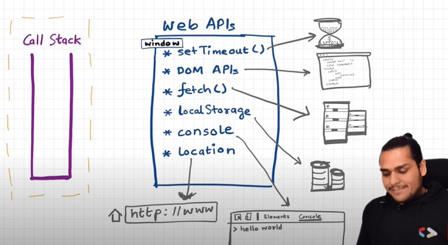

# Episode 15 : Asynchronous JavaScript & The EVENT LOOP

> ⏳ **Note:** The call stack executes whatever enters it. It has no concept of a timer. Time, tide, and JavaScript wait for none.

---

## 🔹 The Browser & JavaScript Engine

- The browser comes with a **JS Engine** (V8, SpiderMonkey, etc.).
- The engine has a **Call Stack**, which runs:

  - Global Execution Context (GEC)
  - Local Execution Contexts

- But the browser itself also has **extra powers**:
  - Local Storage
  - Timers
  - DOM Access
  - Geolocation, Bluetooth, Network requests, etc.

👉 To connect JS with these browser features, we use **Web APIs**.

  
_JS engine inside the browser, connected with Web APIs._

---

## 🔹 Web APIs

⚡ **Important:** None of these belong to JavaScript itself! They’re powers provided by the browser.

Examples:

- `setTimeout()` → Timers
- `DOM APIs` → `document.querySelector`, `document.getElementById`, etc.
- `fetch()` → Network requests
- `localStorage`
- Even `console.log` is **not JS** (it’s a browser-provided API).

  
_Web APIs provide superpowers to JS._

- All these are available inside JS through the **global object** (`window`).
  - Example: `window.setTimeout()`, `window.console.log()`

---

## 🔹 Example: setTimeout & Console

```js
console.log("start");

setTimeout(function cb() {
  console.log("timer");
}, 5000);

console.log("end");
```

### Execution Steps

1. GEC is created → added to the call stack.
2. `console.log("start")` → browser console API → logs "start".
3. `setTimeout(cb, 5000)` → moves `cb` into Web API, starts a timer.
4. `console.log("end")` → logs "end".
5. GEC pops off.
6. After 5s, `cb` wants to run → needs **Callback Queue + Event Loop**.


_setTimeout registers callback with timer._

---

## 🔹 Event Loop & Callback Queue

- Callbacks (like from `setTimeout`) don’t directly jump into the call stack.
- They wait in the **Callback Queue**.
- The **Event Loop** continuously checks:

  - If Call Stack is empty
  - If Callback Queue has something waiting

- If yes → Event Loop pushes callback into Call Stack.


_Event Loop moving callbacks from queue → call stack._

---

## 🔹 Example: Event Listener

```js
console.log("Start");

document.getElementById("btn").addEventListener("click", function cb() {
  console.log("Button clicked");
});

console.log("End");
```

- "Start" → logged.
- Event listener registered in **Web API environment**.
- "End" → logged.
- Listener stays alive (until explicitly removed), waiting for clicks.


_Event Listener stays in Web API environment until removed or browser closes._

---

## 🔹 Why a Callback Queue?

Imagine a user clicks the button **6 times**.

- Each click → pushes one `cb()` into the Callback Queue.
- Event Loop processes them **one by one** when the Call Stack is empty.

---

## 🔹 fetch() & Microtask Queue

```js
console.log("Start");

setTimeout(function cbT() {
  console.log("CB Timeout");
}, 5000);

fetch("https://api.netflix.com").then(function cbF() {
  console.log("CB Netflix");
});

console.log("End");
```

### Explanation

- `fetch()` callback doesn’t go to the normal callback queue.
- It goes to a special **Microtask Queue**.
- Microtask Queue has **higher priority** than Callback Queue.
- Execution order:

  - "Start"
  - "End"
  - "CB Netflix" (microtask first)
  - "CB Timeout" (callback after 5s)


_Callback Queue vs Microtask Queue._


_Microtasks run before callbacks._

---

## 🔹 What Goes Into Microtask Queue?

- **Promise callbacks** (from `.then`, `.catch`, `.finally`)
- **MutationObserver** (DOM change detector)

Everything else (setTimeout, event listeners, etc.) → Callback Queue.

⚠️ If Microtask Queue keeps filling itself, Callback Queue may **never execute** → called **Starvation**.

---

## 🔹 FAQs

1. **When does Event Loop start?**
   It’s always running, from the beginning.

2. **Do sync callbacks (like in `map`, `filter`, `reduce`) go to Web APIs?**
   ❌ No, only async callbacks (setTimeout, fetch, etc.) use Web APIs.

3. **Does Web API keep original callbacks?**
   ✅ Yes. For event listeners, they remain until explicitly removed.

4. **What if `setTimeout(fn, 0)` is used?**
   Even with 0ms, it still waits until Call Stack is empty → might be delayed.

---

## 🔹 Visualizing Event Loop + Queues


---

---

---

---

---

