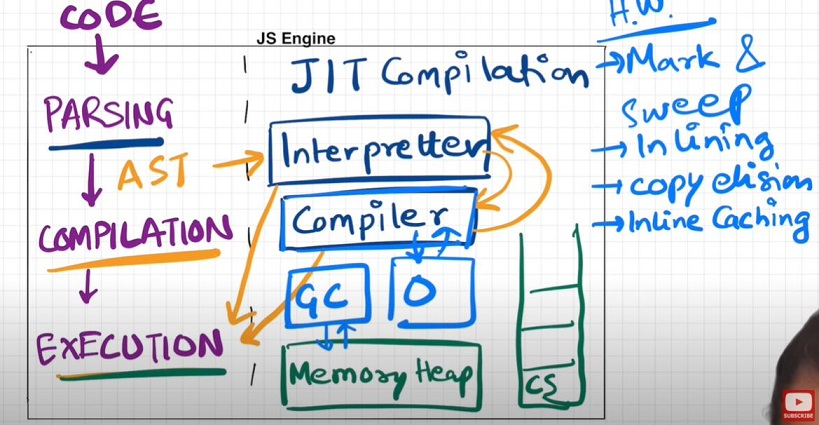

# Episode 16 : JS Engine Exposed ⚙️ — Inside Google’s V8 Architecture

> Ever wondered *how* JavaScript actually runs?  
> It’s all thanks to the **JavaScript Runtime Environment (JRE)** and the **JS Engine** at its core.

---

## 🔹 What is JavaScript Runtime Environment (JRE)?

- JS runs **everywhere** — browsers, Node.js, even smart watches — thanks to the **JRE**.  
- The JRE is a **container** that includes everything required to run JS code:
  - The **JavaScript Engine** (❤️ of JRE)
  - **Web APIs**
  - **Event Loop**
  - **Callback Queue**
  - **Microtask Queue**, etc.

📌 The **browser** can execute JS because it provides a **runtime environment** containing all of this.

---

## 🔹 ECMAScript & Different JS Engines

- **ECMAScript** is the *standard/specification* for JS.  
- Every browser implements its own JS engine based on ECMAScript rules:

  | Engine Name | Platform / Browser |
  |--------------|--------------------|
  | **V8** | Chrome, Node.js, Edge (Chromium) |
  | **Chakra** | Internet Explorer |
  | **SpiderMonkey** | Firefox *(first JS engine ever made)* |
  | **JavaScriptCore (Nitro)** | Safari |

---

## 🔹 What is a JavaScript Engine?

- A **JS Engine** isn’t a machine — it’s a **program written in C/C++** that:
  - Takes **high-level JS code**.
  - Converts it into **low-level machine code**.

💡 So your JS code doesn’t directly “run” — it’s **parsed, compiled, and executed** inside the engine.

---

## ⚙️ JS Engine Workflow

JavaScript code passes through **3 main stages** inside the engine:

### 1️⃣ Parsing
- The code is broken into **tokens**.
  - Example:  
    `let a = 7;` → `let`, `a`, `=`, `7`
- A **Syntax Parser** converts these tokens into an **AST (Abstract Syntax Tree)**.
- The AST represents the structure of your code (try it at [astexplorer.net](https://astexplorer.net)).

---

### 2️⃣ Compilation (JIT — Just-In-Time Compilation)
- JavaScript uses **both an interpreter and a compiler**, known as **JIT Compilation**.
- The process:
  1. AST → **Interpreter** → Converts code into **bytecode**.
  2. While interpreting, **Compiler** works in parallel to **optimize** the code during runtime.

✅ So yes — **JavaScript is a compiled language**, but it compiles *just-in-time* before execution.

🧠 References:
- [You Don’t Know JS (Getify)](https://github.com/getify/You-Dont-Know-JS/blob/2nd-ed/get-started/ch1.md#whats-in-an-interpretation)
- [Stanford CS98 Lecture](https://web.stanford.edu/class/cs98si/slides/overview.html)
- [GreenRoots Blog: Interpreted or Compiled?](https://blog.greenroots.info/javascript-interpreted-or-compiled-the-debate-is-over-ckb092cv302mtl6s17t14hq1j)

---

### 3️⃣ Execution
- The **Execution Phase** uses two main components:
  - **Memory Heap** → where variables & objects are stored.
  - **Call Stack** → where execution contexts are managed.

- A **Garbage Collector** automatically frees unused memory using the **Mark-and-Sweep** algorithm.

*Simplified view of memory and execution in JS Engine.*

🌀 **GIF Demo:**

---

## 🧩 V8 Engine — Under the Hood

Every company has its own JS engine, but **Google’s V8** (used in Chrome and Node.js) is the most popular.

**V8 Components:**
- **Ignition** → Interpreter (converts JS → bytecode)
- **TurboFan** → Optimizing Compiler (makes code faster during execution)
- **Orinoco** → Garbage Collector (memory management)

### 🏗️ V8 Architecture Diagram

---

## 🧠 Summary

| Step | Component | Role |
|------|------------|------|
| Parsing | Syntax Parser | Converts code → AST |
| Compilation | JIT (Ignition + TurboFan) | Interprets & optimizes code |
| Execution | Call Stack + Memory Heap | Runs code & manages memory |
| Garbage Collection | Orinoco | Frees unused memory |

---

✨ **In short:**  
JS Engine is like a mini factory:
> Your code → parsed → compiled → optimized → executed ⚡
