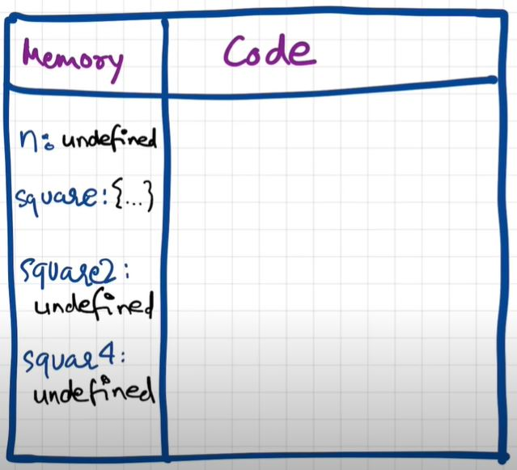
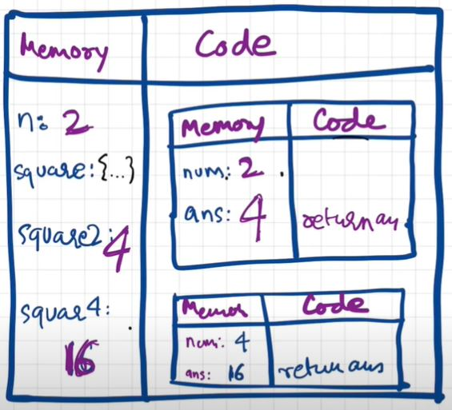

# Episode 2: How JS Runs & The Call Stack

When you run a JavaScript program, the engine creates a **Global Execution Context (GEC)**.  
This execution context is built in **two phases**:

---

## 🔹 1. Memory Creation Phase
- JavaScript scans the code first.  
- Memory is allocated for **variables** and **functions**.
  - Variables are set to `undefined`.
  - Functions are stored with their entire code.  

👉 Example:

```js
var n = 2;
function square(num) {
  var ans = num * num;
  return ans;
}
var square2 = square(n);
var square4 = square(4);
````

**Step-by-step (Phase 1):**

* `n` → memory allocated, value = `undefined`
* `square` → function code stored
* `square2` → memory allocated, value = `undefined`
* `square4` → memory allocated, value = `undefined`

📌 This completes the **Memory Creation Phase**.


---

## 🔹 2. Code Execution Phase

Now JavaScript executes the code line by line:

1. `n = 2` → updates `n` from `undefined` to `2`.
2. Function `square` → skipped here (already stored).
3. `var square2 = square(n)`

   * A **new Execution Context** is created for this function call.
   * Inside this new context:

     * Memory Phase: `num = undefined`, `ans = undefined`
     * Execution Phase:

       * `num = 2`
       * `ans = 2 * 2 = 4`
       * `return ans` → returns `4` to `square2`
   * Function’s execution context is deleted after return.
4. Same process repeats for `square4 = square(4)` → returns `16`.

📌 Before the global execution context is destroyed, the memory looks like this:


---

## 🔹 Call Stack

* JavaScript uses the **Call Stack** to manage execution contexts.
* Think of it like a stack of boxes:

  * The **Global Execution Context** goes first (bottom of the stack).
  * Every time a function is called → a **new Execution Context** is pushed onto the stack.
  * When the function finishes → its context is popped off.

Other names for Call Stack:

* Program Stack
* Control Stack
* Runtime Stack
* Machine Stack
* Execution Context Stack

---

✨ In short:

1. JS first creates memory (all vars/functions).
2. Then executes code line by line.
3. Each function call gets its **own execution context**, managed by the **Call Stack**.

