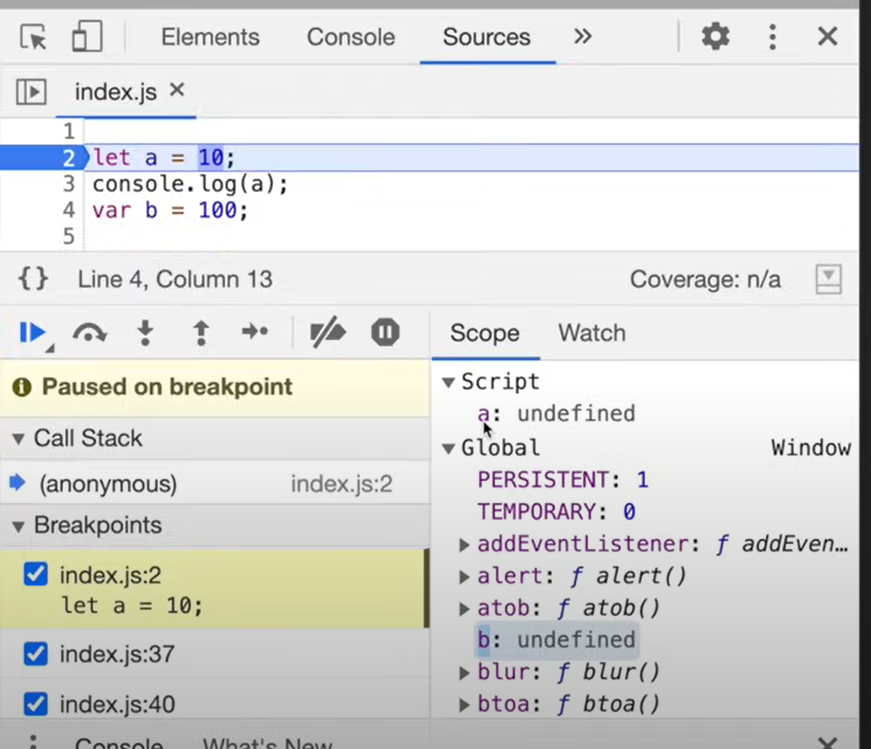

# Episode 8: `let`, `const` & Temporal Dead Zone (TDZ)

## 🔹 Hoisting of `let` and `const`

Yes, `let` and `const` are **hoisted**, but they behave differently than `var`.

```js
console.log(a); // ❌ ReferenceError: Cannot access 'a' before initialization
console.log(b); // ✅ undefined

let a = 10;
console.log(a); // 10

var b = 15;

console.log(window.a); // undefined
console.log(window.b); // 15
```

👉 Explanation:

- Both `a` and `b` are hoisted.
- `var b` → stored in **global object (window in browsers)**.
- `let a` → stored in a separate memory space (called _script_).
  It can only be used **after initialization**, otherwise JS throws a **ReferenceError**.

---

## 

## 🔹 Temporal Dead Zone (TDZ)

- TDZ = the time between **hoisting** of a `let`/`const` variable and its **initialization**.
- Accessing the variable during TDZ → **ReferenceError**.

👉 Example:

```js
// TDZ for "a" starts here
console.log(a); // ❌ ReferenceError
let a = 10; // TDZ ends here
```

- Variables declared with `let`/`const` are **not attached to `window/this`**:

  ```js
  console.log(window.a); // undefined
  console.log(window.b); // 15
  ```

---

## 🔹 Errors in JavaScript

### 1. Reference Error

- **Uncaught ReferenceError: x is not defined**
  → `x` was never declared.

- **Uncaught ReferenceError: Cannot access 'a' before initialization**
  → `a` is in TDZ (declared with `let` but not yet initialized).

### 2. Syntax Error

- Duplicate declarations in the same scope:

  ```js
  let a = 10;
  let a = 100; // ❌ SyntaxError
  var a = 100; // ❌ SyntaxError (when "a" is already let)
  ```

- Missing initializer in `const`:

  ```js
  const b; // ❌ SyntaxError
  b = 10;
  ```

### 3. Type Error

- Reassigning a `const`:

  ```js
  const b = 100;
  b = 1000; // ❌ TypeError: Assignment to constant variable
  ```

---

## 🔹 Difference Between `let` and `const`

```js
let a;
a = 10;  // ✅ allowed
console.log(a); // 10

const b; // ❌ SyntaxError: Missing initializer
b = 10;

const c = 100;
c = 200; // ❌ TypeError
```

- **`let`** → can be declared first and assigned later.
- **`const`** → must be declared **and initialized immediately**, cannot be reassigned.

---

## ✅ Best Practices

- Prefer **`const`** (safer, avoids accidental reassignment).
- Use **`let`** if value needs to change.
- Avoid `var`.
- Always **declare variables at the top** to reduce the risk of TDZ-related errors.

---

✨ **Summary**

- `let` and `const` are hoisted but not accessible before initialization → TDZ.
- TDZ lasts from hoisting until the line of initialization.
- `var` is function-scoped + attached to global object.
- `let`/`const` are block-scoped + not attached to global object.
- `const` requires immediate initialization and cannot be reassigned.
