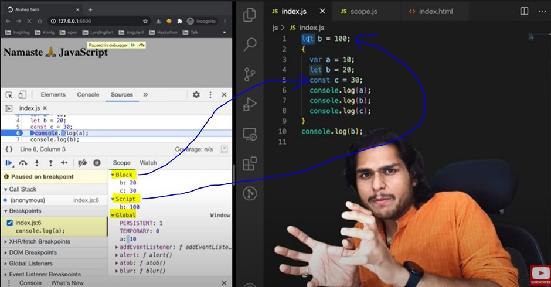

# Episode 9: Block Scope & Shadowing in JavaScript

## 🔹 What is a Block?
- A **block** (or compound statement) groups code inside `{ ... }`.
- Useful for creating new scopes.

```js
{
  var a = 10;
  let b = 20;
  const c = 30;

  // Here:
  // - let and const are hoisted inside block scope
  // - var is hoisted in global scope
}
````

---

## 🔹 Block Scope Example

```js
{
  var a = 10;
  let b = 20;
  const c = 30;
}

console.log(a); // ✅ 10
console.log(b); // ❌ ReferenceError: b is not defined
```

👉 Why?

* `let` and `const` are stored in **block memory**, so they vanish outside `{}`.
* `var` is **not block-scoped**, it’s global (or function-scoped if inside a function).

---

## 🔹 What is Shadowing?

Shadowing happens when a variable inside a block has the **same name** as a variable outside.
The inner one **temporarily “shadows”** (overrides) the outer one.

### Example with `var`:

```js
var a = 100;

{
  var a = 10; // shadows global "a"
  let b = 20;
  const c = 30;

  console.log(a); // 10
  console.log(b); // 20
  console.log(c); // 30
}

console.log(a); // 10 (global "a" got overwritten!)
```

👉 With `var`, shadowing **replaces the global variable** because `var` is not block-scoped.

---

### Example with `let` and `const`:

```js
let b = 100;

{
  var a = 10;
  let b = 20;   // shadows outer b
  const c = 30;

  console.log(b); // 20 (block "b")
}

console.log(b); // 100 (outer "b" remains untouched)
```

👉 With `let`/`const`, shadowing is safe:

* Block variable stays in block memory.
* Outer variable is preserved.

---

## 🔹 Shadowing with Functions

```js
const c = 100;

function x() {
  const c = 10;
  console.log(c); // 10 (local shadows global)
}

x();
console.log(c); // 100 (outer one is safe)
```

✅ Works the same way as with `let`/`const`.

---

## 🔹 Illegal Shadowing

Some kinds of shadowing are **not allowed**.

```js
let a = 20;

{
  var a = 20; // ❌ SyntaxError: Identifier 'a' has already been declared
}
```

👉 Rules:

* ❌ You **cannot** shadow a `let` with a `var`.
* ✅ You **can** shadow a `var` with a `let`.
* ✅ You **can** shadow a `let` with another `let` (in a new block).
* Functions and arrow functions follow the same scope rules.

```js
let a = 20;

function x() {
  var a = 20; // ✅ legal (var is function-scoped)
}
```

---

## ✨ Key Takeaways

* `var` → global/function-scoped, not block-scoped.
* `let` & `const` → block-scoped, safer.
* Shadowing with `var` overwrites outer variable.
* Shadowing with `let`/`const` keeps outer variable intact.
* Illegal shadowing happens when you try to mix `var` and `let` incorrectly.


